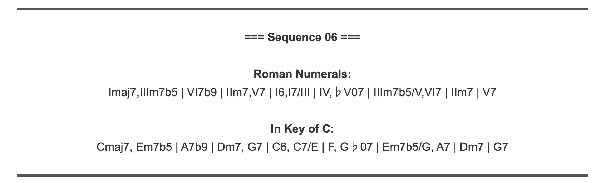
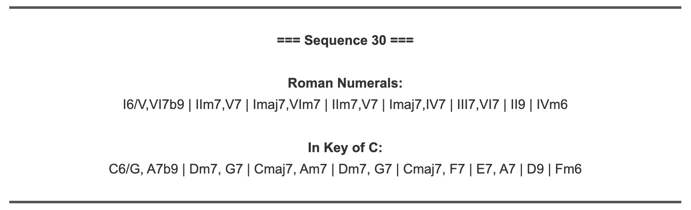

## Try It For Yourself

After spending more time than I'd like to admit dealing with `R Shiny`, the finalized model is available for public use below!

<style>
  .jazz-button {
    font-size: 20px;
    font-weight: 600;
    padding: 16px 32px;
    background-color: #E78FA5;
    color: white;
    text-decoration: none;
    border-radius: 10px;
    box-shadow: 0 4px 12px rgba(0, 0, 0, 0.25);
    transition: background-color 0.3s ease;
    display: inline-block;
    position: relative;
  }

  .jazz-button:hover {
    background-color: #F8C8DC;
  }

  .note {
    display: inline-block;
    margin-left: 12px;
    font-family: serif;
    transition: transform 0.4s ease;
  }

  .jazz-button:hover .note {
    transform: rotate(20deg) scale(1.15);
  }
</style>

<div style="text-align: center; margin: 40px 0;">
  <a href="https://bes57.shinyapps.io/jazzshiny/" target="_blank" class="jazz-button">
    Launch the Jazz Progression Generator<span class="note">♩</span>
  </a>
</div>


## Examples!

One fundamental flaw in presenting this project is that, for 99% of people on this planet, there's no way to tell if the jazz progressions that my program is generating are *good*. I've been consistently making tweaks based on my ability to recognize flaws in the progressions, but it's not clear to the average reader how much more coherent the progressions are getting just by looking at them.  

For example, if I told you that this chord progression below was generated by my model, it would seem pretty impressive.  
<br>
$|\ \text{Cmaj7/E},\ \text{Fm7},\ \text{B♭7}\ |\ \text{E♭maj7},\ \text{D♭maj7}\ |\ \text{Cm7},\ \text{Bm7}\ |\ \text{Cmaj7},\ \text{D9},\ \text{B7/E♭}\ |$\
$|\ \text{Em9},\ \text{E♭maj7}\ |\ \text{Gmaj9/D},\ \text{D♭m7b5}\ |\ \text{Cmaj7},\ \text{B♭69}\ |\ \text{A9},\ \text{D7sus}\ |$
<br>

However, this is one of the worst chord progressions I've seen in my life. So, as this project comes to a close, I'm going to showcase a few chord progressions generated by my model, to prove that my model is now able to generate complicated, dynamic chord progressions that sound *good!*  

*Disclaimer: All of the following chord progressions were generated with seed number 756. As proof that these are naturally generated progressions from my model, you can go generate them yourself at the above website.*

<div style="text-align: center;">
  <h2><em>Chord Progression 1</em></h2>
  
</div>  

```{r, echo=FALSE, results='asis'}
cat('
<div style="text-align: left; margin: 0; padding: 0;">
  <div style="margin-left: -580px; display: inline-block;">
')
knitr::include_url("https://streamable.com/e/auq0bz")
cat('
  </div>
</div>
')
```

<div style="text-align: center;">
  <h2><em>Chord Progression 2</em></h2>
  
</div>  

```{r, echo=FALSE, results='asis'}
cat('
<div style="text-align: left; margin: 0; padding: 0;">
  <div style="margin-left: -580px; display: inline-block;">
')
knitr::include_url("https://streamable.com/e/5gzybq")
cat('
  </div>
</div>
')
```
