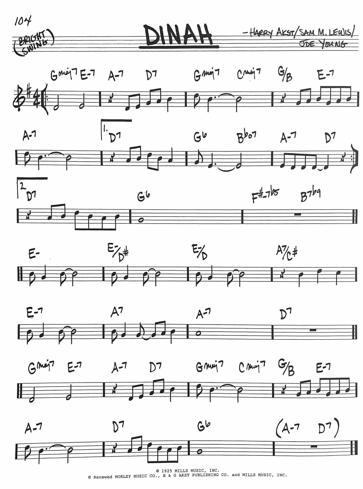

## Introduction

As the modern world is evolving around AI, people are too focused on questions like "How will AI help medical research?" and "Can AI help with accessibility for disabled people?" Instead we should be focused on the *REAL* problems AI can help with, like creating jazz chord progressions. So, here I am, ready to save the world.  

Jokes aside, that is the goal of this personal research project: **To build a large language model (LLM) capable of generating jazz chord progressions with harmonic coherence.** 

## Background

Now, as much as I'd like to live in a world where everyone had a baseline level of jazz-theory knowledge, that is (sadly) not reality. Therefore, it's necessary to provide a simple explanation of what a chord progression is and its function in jazz music. 

Chord progressions simply are defined as a sequence of chords over a blocked amount of musical time. They are not instructions on what to play specifically, as much as they are describing the harmonic backbone of a musical piece. For example, an overly-simplistic chord progression would be:  
$|\ \text{C}\ |\ \text{Am}\ |\ \text{F}\ |\ \text{G}\ |$. What this means is that, for the four bars of this progression, the first bar is in the key of C, the second in A minor, etc. This is simply just a *framework*. Jazz musicians then take these progressions and play over them. This means they're constantly aware of what measure they're in within the progression, and then improvise their melodies or perform they're comping (short for "accompanying", meaning to provide background harmonics to outline the progression) all based on the current key of the progression. 

How does this look in jazz? Well, jazz music is typically stored in something called "lead sheets". A lead sheet condenses a song down to its essential elements: the melody (usually notated in standard notation) and the chord progression (written above the staff). This is all a jazz musician needs to interpret and perform a tune — the rest is up to personal style and improvisation. For example, look at the below lead sheet for a personal favorite standard of mine, Dinah.

<div style="text-align: center;">

```{r, echo=FALSE}

```

</div>

As you can see above, lead sheets are noticingly sparse, but any half-decent jazz combo should be able to use the progression within the lead sheet to immediately understand how to provide harmonies, the context in which to solo, and the direction of the tune. That's the power of the jazz chord progression; the minimal instructions and shared outline create entire songs full of natural interaction and improvisation.

---

In case you can't tell by now, a key part of being a jazz musician is being able to pick up and play around progressions on the fly. One such way I learned to practice this ability, is through something called "The Game of Chords".

In it, each card represents a single bar of harmony, and the properties of the card determine the type of chord in that bar. Specifically:

The rank (Ace through 7) determines the scale degree, or the chord's root relative to a key. For example:

 - 1 (Ace) = I

 - 2 = II

 - 3 = III

 - 4 = IV

 - etc.

The suit tells you the quality of the chord, i.e., whether it's major, minor, dominant, or diminished:

 - Hearts = major (e.g., IV, I)

 - Spades = minor (e.g., ii, vi)

 - Diamonds = dominant seventh (e.g., V7)

 - Clubs = diminished or half-diminished

So for example, the 5 of Diamonds would represent a V7 chord.

You deal yourself some amount of cards (typically 4 or 8) and then are forced to improvise on the spot over the drawn chord progression. It's a great exercise, but I noticed a problem: without any logic and only pure randomness, you often get chord progressions with no cohesion. Frankly, most chord progressions from this game are atonal, dissonant, and most importantly *unrealistic*. It's good to have the experience of dealing with challenging chord progressions on the fly, but they're often unsatisfying and difficult to learn from as they're so dissimilar from real-world progressions. 

That's the inspiration for this project: by blending jazz intuition with probabilistic modeling, I hope to build a model that generates chord progressions with enough structure to feel intentional, yet enough variation to remain unique and useful for practicing.