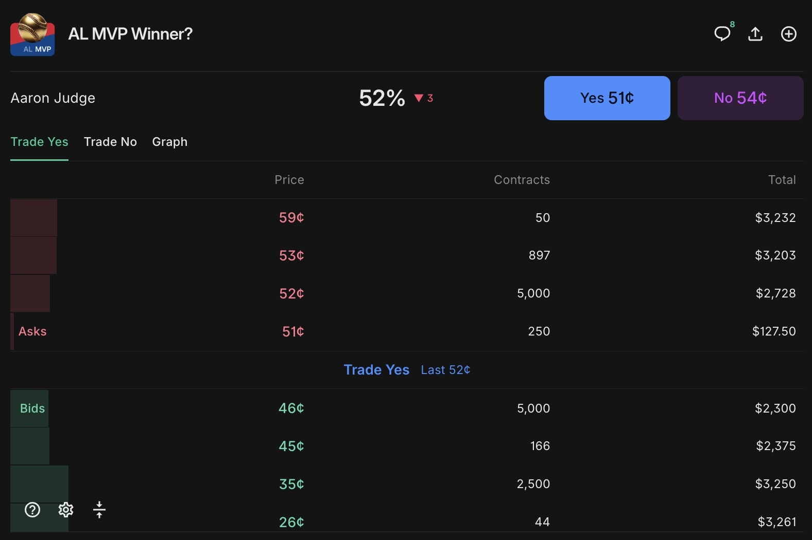

## Introduction

As is mentioned in my first entry, this journal is solely for fun, with an emphasis on "results/narratives". It is in this spirit that I'm writing this entry to discuss a personal curiosity of mine about Kalshi that isn't related to numbers or graphs: is trading on Kalshi "moral" per se?

For the past 3-4 months, I've spent (on average) ~ two hours a day on Kalshi. On top of that, the money I'm making has to be coming from somewhere (and someone). Because of the shear amount of time that I've put into Kalshi on top of the money I'm making, I think it's both natural and healthy to question whether this is a "good" usage of my time/source of income.  

---

## Kalshi is used for gambling, Sgt. Peppers is the best Beatles album, and other lies

In case you can't tell by this section's title, I don't believe that trading on Kalshi is equal to gambling, at least not in its traditional meaning. I think this is a good place to start, because:  

1. People often assume Kalshi is used for gambling  

2. I, and many others, believe that consistent gambling is neither moral nor wise  

3. I need to disprove the default assumption of Kalshi's nature before I can get to other understandings of Kalshi and its morality.
<br>


#### The existence of a "house" in gambling

<br>
In almost all instances of gambling, there is a distinctive feature of a "house" which takes the opposite outcome as the bettor. For example, if you go to sports bet on the Dodgers to win the world series, the main platforms (such as FanDuel or DraftKings) serve as the "house" and propose the odds that you can either take or not. It is this existence of a house that is a large part of why I view gambling as unwise and immoral.  

The house computes these odds completely in the dark, and any well-informed person would know that partaking in these single, straight-forward bets is completely unwise. The house is always a company that wants to make money and, as there is no bargaining room, they are only incentivized to put forth odds that are advantageous to them and disadvantageous to the bettor. In other words, **when you make a bet against the house, you are the sucker**.  

Furthermore, these companies are filled to the brim with supercomputers and historical data to estimate fair odds which they can then *undercut*, so gambling on these platforms is effectively stating that you believe you are smarter than their millions - sometimes billions - of dollars that they're putting into computing fair odds that they can then distort for the bettor. This is just another way of saying the previous statement - **when you make a bet against the house, you are the sucker**.  

It is this shadiness in the way that the house computes odds, a lack of bargaining from the bettor's side, and the well-understood negative EV of gambling against the house that leads me to generally disapprove of gambling. The existence of a house which proposes fixed and disadvantageous odds in conjunction with the addictive nature of gambling makes it:  

- immoral from the house's perspective  
- unwise from the bettor's perspective  

I don't believe it needs to be outlawed and I'm not vehemently opposed from making a small bet when you're at a racetrack with your friends or family, but I do think it’s important to recognize it for what it is: entertainment with a negative expectation. This is why I disapprove of "consistent" gambling, as mentioned previously. 

#### How is Kalshi different?  
<br>
On Kalshi, there is no house in this sense. There are two distinctive features that make it *better*.

1. All contracts are completed between two consenting human beings. In Kalshi, you have two options: either buying contracts at a certain price (proposed odds) from someone who is willing to take the opposite side, or proposing a certain price (proposed odds) and hoping someone else is willing to take the opposite side of the contract. Instead of predicting an outcome through an organization that is shady in its operations and disadvantageous to the bettor, there are two consenting individuals that have a genuine difference in belief about the future and clear understanding of what contract they're getting into. It is not a one-sided, exploitative scheme. Also, this means that if you lose, your money doesn't go to a betting company.

2. The pricing is much more transparent. The difference in purchasing proposed odds and proposing your own odds, results in a spread (see a below example):  

<div style="text-align: center;">
```{r, echo=FALSE, out.width="70%"}

```
</div>
That spread is fully visible to everyone on the platform. You know exactly what price you’re getting, what others are offering, and can make an informed decision based on this.  

#### Soooooo, it's gambling but better?  
<br>
Yes and no. As I've outlined, Kalshi *can* be used for gambling, but in a less predatory and more transparent manner. But this is not the only way to use Kalshi, nor is this the way I use Kalshi.  

The existence of these spreads (as previously pictured) allows for trading. Once contracts are bought, you aren't forced to hold until resolution; you can sell them back, either for profit or to minimize losses. This is where Kalshi deviates from gambling and rewards strategic market analysis. For example, there is profit to be made by market-making within spreads, using historical knowledge of a certain market's behavior to anticipate price drift, or building arbitrages between mispriced markets. These trading strategies are, in large part, how I have used Kalshi and also how I've found my profit.

To someone who doesn't know much about trading, this description could be too vague and jargon-filled to serve as a convincing argument that trading on Kalshi isn't gambling. Without going into too much detail, I'll just quickly make a few other general points about what "trading" on Kalshi looks like for me. 

- A large majority of the time, I trade irrespective of a game's outcome. For example, if I'm trading on some Yankees-Dodgers game, I would heavily trade in between innings so that my trading isn't influenced by any real-world sports happenings; I'm not trading with any game outcome in mind, just purely based on the efficiency and liquidity of the market. Unlike gambling, I'm not sitting back and crossing my fingers that I get a random result.

- I trade with certain frequencies and strategies so that I am (typically) not subject to wild swings in certain directions. Unlike gambling - where you can swing between large amounts of profit and loss based on chance - I have strategy-based consistency and profitability. I never find myself watching hundreds of dollars swing one way or another.


If you're not convinced, then don't take me from it - take it from Kalshi and its legal specifics. Kalshi is regulated by the commodity futures **trading** commission (CFTC). Furthermore, each contract traded on the exchange is subject to the *Commodity Exchange Act*. In fact, the Kalshi Rulebook makes it explicit:  

*“All Kalshi Contracts are deemed to be ‘options’ as defined in 7 U.S.C. § 1a(47).”*  

This means that the government places Kalshi contracts in the same statutory bucket as financial options, with each trade being governed by the same regulatory framework that applies to other commodity derivatives.  

## Sure, Kalshi can be used for trading - but is it moral?  

With all of that out of the way, I can talk a bit more about my thoughts on the morality of trading on Kalshi.  

I think the most intuitive angle is through a functionalist lens; that is, objectively understanding how my participation in trading affects me, other traders, and the market system. The argument here would be that other traders will trade regardless of my participation and, as I am only able to trade by undercutting the highest sells/overpricing the highest bids, I'm offering a service to other people on the market by providing better quotes in either direction. In other words, I'm giving other people looking to buy or sell more favorable prices. This is a slightly optimistic way of viewing it, but there's some truth here. It's not that this is some large, powerful "good", but there is an objective way that I benefit others. And, of course, I get to generate money and develop analytic skills, so there's an undeniable objective benefit to myself.

However, I think that trading is viewed in a less favorable light if you were to ask a believer in Kantian Ethics. One of the core axioms is the idea of universal applicability - that is, an action or principle is determined as right if it would be good for everyone else to do that action/think that way. In my opinion, trading on Kalshi isn't looked at favorably through this lens. It's something based on greed and personal gain, and I would rather live in a world focused on selflessness and helping others. Paint it however you'd like, but being profitable on Kalshi requires others to be losing money. Profitable trading strategies require others to make mistakes. That's not how I would want a society to be earning their livings. There's truth to this: I want to live my life honorably and morally.

To this, I'd offer a slight rebuttal - not an entire rejection, but some of my own thoughts. While trading is dependent on others to lose money, I don't think that making $5 in a trade is the same thing as taking a $5 bill from someone. To some extent, there's a mutual consent when trading between the two parties. There has to be a genuine disagreement in pricing, and both parties think they will end up profitable, and - as I am devoid of any insider information and on an even playing field - the trade is not necessarily exploitative. Each individual has their own autonomy and is able to choose whether or not to wager their own money. Both the person offering a quote and the person picking it up *want* the trade to occur as evidenced by these two actions.

If you were to ask a Marxist, they would say "Trade more! Captial is the end goal of life."

In all seriousness, those are the angles I chose because they are more or less how I've come to understand trading. I think it all serves no societal purpose/benefit, rather acting detrimentally (if anything). It is entirely centered around materialistic gain and dependent upon others to lose in order for you to gain (i.e. individualism). These are not the ideals I'd want to teach others or myself. There are good lessons to be taught from trading about risk management, analytical thinking, discipline, etc., but they feel detached from the natural "goodness" of humanity. But, at the end of the day, we live in a world where you need money to function. As each trader is consenting (either by placing resting orders or picking them up) to trade based on a difference of opinion, I don't feel that it's wrong to be individually trading as a means of revenue. It may not be a noble activity, but it's neither deceptive nor theft. If anything, you're providing a service by offering more favorable prices to others.  

In my opinion, trading is a morally gray activity, but I think it's important to recognize how trading is devoid from some larger meaning or purpose unto others. As I've traded more, I find myself feeling a bit less fulfilled. Given this, I should try to be more conscious of acting "good" in the other moments in my life. There's nothing wrong with trading on your own, but you can't let it swallow up your life, or you'll end up feeling soulless.


